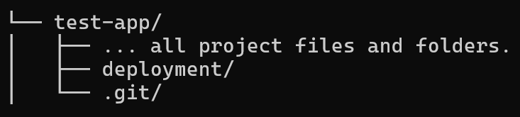
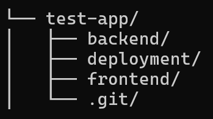
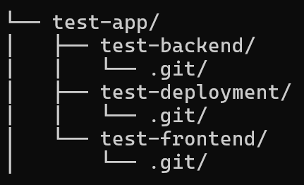

# Initialize a Deployment Repository

To generate the Deployment Repository, follow these steps.

Let's suppose your app is called "Test App".

## Monolith Setup

#### Visual representation of a Monolith directory structure:



## Monorepo Setup

If you are using a monorepo, where all the source code is managed under the same version control, and for example, you have it locally in a folder named "test-app" with separate folders for the backend and frontend:

```sh
user@localhost:~/projects$ cd test-app/
user@localhost:~/projects/test-app$ ls -la
drwxr-xr-x .git # Version control for the entire source code
drwxr-xr-x backend
drwxr-xr-x frontend
```

You can create a "deployment" folder within this structure:

```sh
user@localhost:~/projects/test-app$ mkdir deployment
user@localhost:~/projects/test-app$ ls -la
drwxr-xr-x .git
drwxr-xr-x backend
drwxr-xr-x deployment
drwxr-xr-x frontend
user@localhost:~/projects/test-app$ cd deployment
user@localhost:~/projects/test-app/deployment$ git init
```

To summarize the above, you can use this command:

```sh
mkdir deployment && cd deployment && git init
```

#### Visual representation of a Monorepo directory structure:



## Multirepo Setup

If you are using a multirepo setup, where each part of the project is managed with its own version control, it might look like this:

```sh
user@localhost:~/projects$ cd test-app/
user@localhost:~/projects/test-app$ ls -la
drwxr-xr-x test-backend
drwxr-xr-x test-frontend
# No .git folder here; each repo (test-backend and test-frontend) has its own .git folder
```

In this case, you can create a new repository to manage all the deployment code separately:

```sh
user@localhost:~/projects/test-app$ mkdir test-deployment
user@localhost:~/projects/test-app$ ls -la
drwxr-xr-x test-backend
drwxr-xr-x test-deployment
drwxr-xr-x test-frontend
user@localhost:~/projects/test-app$ cd test-deployment
user@localhost:~/projects/test-app/test-deployment$ git init
```

To summarize the above, you can use this command:

```sh
mkdir APP_NAME-deployment && cd APP_NAME-deployment && git init
```

#### Visual representation of a Multirepo directory structure:



#### Setting up a remote:

Create a repository on your chosen version control platform (GitHub, GitLab, Bitbucket, etc.) and link the remote with the local repository.

```sh
user@localhost:~/projects/test-app/test-deployment$ git remote add origin <remote-repo-url>
```

## Monolith

Deployment folder here is the same as Monorepo
