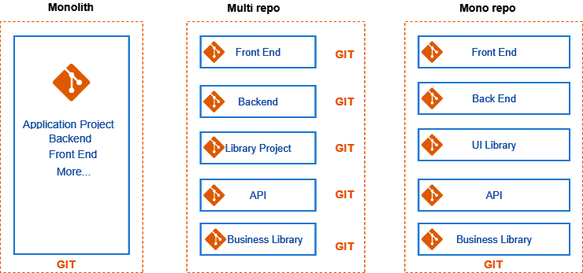

# Identify Your Project's Structure

When managing web application projects, choosing the right repository structure is crucial. Here are three common approaches:

- **Monolith**: A single repository for the entire application. Ideal for smaller projects but can become unwieldy as the project grows.

- **Monorepo**: A single repository containing multiple related projects or modules. This approach simplifies coordination but can require more management as the repository grows.

- **Multirepo**: Separate repositories for each component or module. Provides flexibility and independence but requires careful integration management.

Each approach has its benefits and challenges, and the best choice depends on the project's size and needs.

